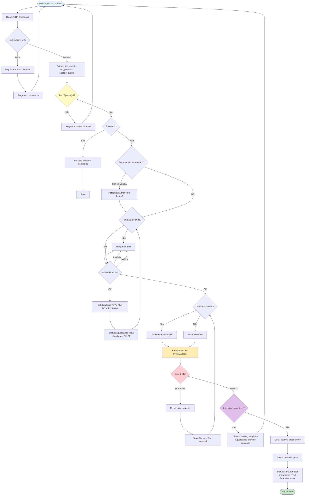

# Coding Guidelines & Architectural Laws

## 0. Fluxo de Decisão do ChatWidget (Une.AI Orchestrator)

### Explicação dos Estados do Fluxo

| Estado | Descrição | Ação do ChatWidget |
|--------|-----------|---------------------|
| `dados_incompletos` | Faltam tipo ou qtd | Mostrar input apenas para dado faltante |
| `aguardando_data` | Aguardando confirmação de data | Bloquear botão "Gerar Itens" |
| `dados_completos` | Todos dados básicos presentes | Habilitar botão "Gerar Itens" |
| `itens_gerados` | Lista de itens persistida | Mostrar snapshot visual dos itens |

### Tratamento de Erros

1. **JSON Parse Error:** Limpeza de backticks/markdown antes do `JSON.parse`
2. **RLS Error:** Reset do `eventoId` local + toast Sonner de erro
3. **Invalid Date:** Re-pedir data com formato claro (DD/MM/AAAA)
4. **Missing Context:** Detectar edição vs. criação para carregar/salvar corretamente

### Integração com Arquitetura

- **Orquestrador:** `simpleOrchestrator.ts` (NUNCA `chatOrchestrator.ts`)
- **IA:** `groqService.ts` com prioridade para chaves específicas
- **Banco:** Acessos via `src/api/rpc.ts`
- **Persistência:** `upsertEvent` no `eventManager`
- **UI:** `shadcn/ui` + `sonner` toasts

---

## 1. AI & Orchestration Architecture

- **Single Source of Truth:** O único orquestrador válido é `src/core/orchestrator/simpleOrchestrator.ts`.
- **Legacy Ban:** O arquivo `chatOrchestrator.ts` é obsoleto/legado e **NÃO** deve ser importado ou utilizado.
- **Groq Service:** A inteligência reside em `src/services/groqService.ts`. Ele deve priorizar chaves específicas (`tipo_evento`, `finalidade_evento`) sobre genéricas.

## 2. JSON & Data Reliability

- **Strict Parsing:** Respostas da IA devem ser tratadas com uma função de limpeza (remover backticks/markdown) antes do `JSON.parse`.
- **Schema Enforcement:** A IA não pode inventar chaves (ex: `event_name`). Deve-se usar estritamente `tipo_evento` e `qtd_pessoas`.
- **Hierarquia:** Se a IA extrair `subtipo_evento` (ex: "Festa Junina"), isso tem precedência sobre `tipo_evento` (ex: "Festa") na lógica de decisão.

## 3. Date & Timezone Handling (Critical)

- **No UTC for Dates:** Nunca utilize `new Date().toISOString()` para definir datas de eventos, pois isso converte para UTC e causa o bug "D-1" (dia anterior) no Brasil.
- **Local Date:** Para definir "hoje", use `new Date().toLocaleDateString('en-CA')` (formato YYYY-MM-DD local) ou construa a string manualmente baseada nos métodos locais (`getFullYear`, `getMonth`, `getDate`).
- **Parsing:** Ao validar datas futuras, force o horário para `T12:00:00` para evitar viradas de dia indesejadas por fuso horário.

## 4. Database Access (Supabase)

- **Access Layer:** Todo acesso ao banco deve ser feito via `src/api/rpc.ts` ou funções encapsuladas. Não chame `supabase.from` diretamente na UI.
- **Upsert Logic:** A criação/edição de eventos deve usar a função unificada `upsertEvent` no `eventManager`.
- **Error Handling:** Erros de permissão (RLS) ao tentar editar um evento devem acionar uma limpeza de ID local (`reset`) em vez de travar a aplicação.

## 5. UI/UX Standards

- **Component Library:** Use `shadcn/ui`.
- **Feedback:** Use `sonner` para toasts.
- **State Management:** O `ChatWidget` deve gerenciar o `eventoId` com cuidado, limpando-o explicitamente ao iniciar um novo fluxo ("Novo Evento").
